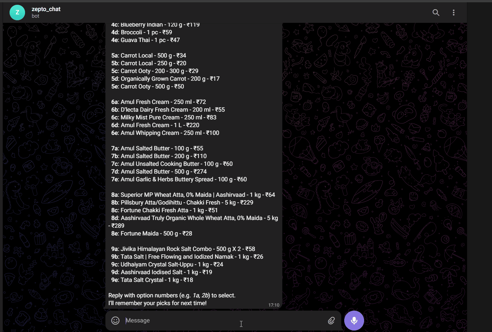

# Grocery Bot — Telegram + Zepto

A Telegram bot that lets household members order groceries from [Zepto](https://www.zepto.co.in/) via text or voice messages. It parses natural language requests, respects household dietary preferences, manages the cart, and handles checkout with online payment or Cash on Delivery.

## Demo



## Features

- **Text & voice input** — send a grocery list as text or a voice note (transcribed via faster-whisper)
- **Intent parsing** — extracts item names from free-text, preserves brand names (e.g. "Amul butter")
- **Household preferences** — per-member dietary restrictions with automatic conflict detection
- **Product memory** — remembers your preferred Zepto product for each item; auto-selects on repeat orders
- **Cart management** — search Zepto for top options, pick by code (1a, 2b, etc.), add to cart
- **Order preview** — dry-run with cost breakdown; validates min ₹100, max ₹370, free delivery
- **Payment choice** — online payment (with payment link) or Cash on Delivery
- **Order history** — saves placed orders, viewable via `/history`

## Architecture

| File | Purpose |
|------|---------|
| `bot.py` | Telegram bot entry point, conversation flow, all `/commands` |
| `zepto.py` | Zepto MCP client — search, cart, preview, place order |
| `llm.py` | Groq LLM for intent parsing & preference reconciliation |
| `db.py` | SQLite persistence (members, preferences, order history) |
| `transcriber.py` | Voice-to-text via faster-whisper |

### External Services

- **Groq** (llama-3.3-70b-versatile) — intent parsing & preference reconciliation
- **OpenRouter** (gpt-oss-120b:free) — Zepto MCP tool-calling loop
- **Zepto MCP** (`mcp.zepto.co.in/mcp`) — cart operations via `npx mcp-remote`
- **Telegram Bot API** — via python-telegram-bot v20+

## Setup

### Prerequisites

- Python 3.10+
- Node.js (for `npx mcp-remote`)

### Install

```bash
pip install -r requirements.txt
```

### Environment Variables

Create a `.env` file in the project root:

```
TELEGRAM_BOT_TOKEN=<your-telegram-bot-token>
GROQ_API_KEY=<your-groq-api-key>
OPENROUTER_API_KEY=<your-openrouter-api-key>
```

Optional (have defaults):

```
ZEPTO_MCP_URL=https://mcp.zepto.co.in/mcp
WHISPER_MODEL=small
DB_PATH=grocery_bot.db
```

### Run

```bash
python bot.py
```

On first run:
- SQLite database is auto-created
- Zepto MCP may require OAuth authentication (browser popup)
- First voice transcription downloads the Whisper model (~400 MB)

## Bot Commands

| Command | Description |
|---------|-------------|
| `/start` | Welcome message |
| `/register <name>` | Join the household |
| `/preferences <restrictions>` | Set dietary restrictions (e.g. vegetarian, no nuts) |
| `/myprefs` | View your current preferences |
| `/clearprefs` | Delete all your preferences |
| `/status` | Check current Zepto cart contents |
| `/history` | View your last 3 orders |
| `/cancel` | Cancel current checkout flow |
| `/help` | Show all commands |

## Conversation Flow

```
User sends text / voice note
  ↓
Parse grocery intent (Groq LLM)
  ↓
Reconcile with household dietary preferences
  ↓
Split items: known (saved preference) vs new (need search)
  ├─ Known → auto-add to cart
  └─ New → search Zepto → show options → user picks → save & add
      ↓
"Checkout or add more?"
  ├─ "more" → accept new items
  └─ "checkout"
      ↓
  Preview order (dry-run with cost breakdown)
    ├─ Fails validation → show reasons, ask to adjust
    └─ Passes → "Place order? yes/no"
        ├─ "no" → cancel, cart preserved
        └─ "yes" → "Online or COD?"
            ├─ "online" → place order → show payment link
            └─ "cod" → place order → confirm COD
```

## Database Schema

```sql
-- Household members
CREATE TABLE members (
    telegram_id   INTEGER PRIMARY KEY,
    name          TEXT NOT NULL,
    household_id  TEXT DEFAULT 'default',
    preferences   TEXT DEFAULT '',
    joined_at     TEXT DEFAULT (datetime('now'))
);

-- Remembered product picks per item keyword
CREATE TABLE product_preferences (
    telegram_id   INTEGER NOT NULL,
    item_keyword  TEXT NOT NULL,
    zepto_product TEXT NOT NULL,
    last_used_at  TEXT DEFAULT (datetime('now')),
    PRIMARY KEY (telegram_id, item_keyword)
);

-- Placed order history
CREATE TABLE order_history (
    id            INTEGER PRIMARY KEY AUTOINCREMENT,
    telegram_id   INTEGER NOT NULL,
    summary       TEXT NOT NULL,
    ordered_at    TEXT DEFAULT (datetime('now'))
);
```
